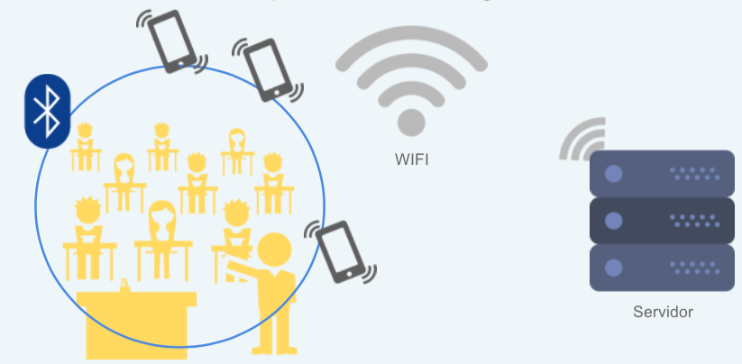
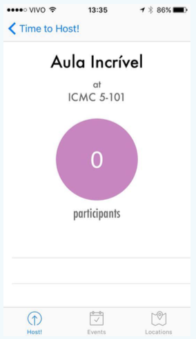
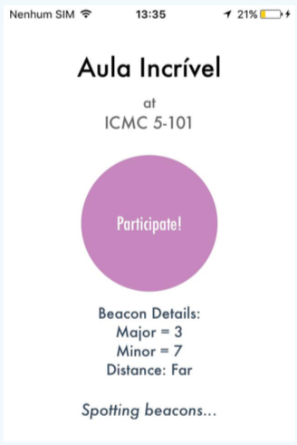
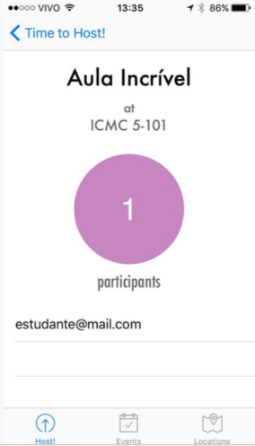
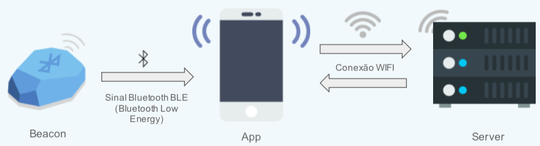
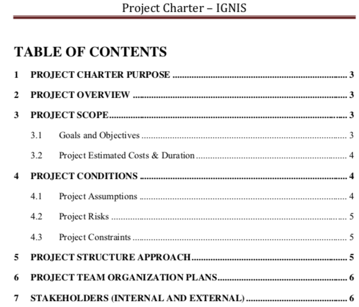

# IGNIS

 

OVERVIEW
--------------------------------------------------
The purpose of this project was to implement a mobile application that integrates Beacon Technology and make use of Computer Network and Wireless Communication concepts for the [Computer Networks and Advanced Communication] course. It was made at the Computer Science undergraduate program from University of São Paulo (ICMC - USP).
The beacon used in this project was provided by a local company.

There was a workshop promoted by the University of São Paulo and CeMEAI (Research Center for Mathematical Sciences Applied to the Industry) in which companies came to see the projects that were made in this course. The idea of proposing Beacon applications was from a local company which made a contest called Be An Icon. The workshop was the last checkpoint of the Computer Networks and Advanced Communication course. 

PROJECT
--------------------------------------------------
Ignis is an event manager which you can host events and control the number of participants in real time using any mobile device.
Through the app you can control the number of participants of a lecture or any event you host, this would eliminate the need of a list.

HOW DOES IGNIS ACTUALLY WORK?
--------------------------------------------------
There are two versions of the application:

* The host app: this is used by the person who's hosting an event.
* The user app: this is for the participants.

Through the host app, the person who's in charge of the event can Add events with Geolocation and start hosting it, then the users can register themselves in the event and participate.

How is this possible and how can you control it in real time? 
With the use of beacon technology, you can do it.

Application Architecture

INTERFACE
--------------------------------------------------

* The Host interface: in this case, the professor added an event called Aula Incrível which is a lecture and started hosting it.

* The user interface: the student registered himself in the app and now he can participate.

The host app can now view the number and information about the participant.

WHAT IS A BEACON AND HOW DOES IT WORK?
--------------------------------------------------
Please watch this [video]

Bluetooth beacons are hardware transmitters - a class of Bluetooth low energy devices that broadcast their identifier to nearby portable electronic devices. The technology enables smartphones, tablets and other devices to perform actions when in close proximity to a beacon.

System Architecture

FRAMEWORKS AND PLATFORMS
--------------------------------------------------
Apple Swift to implement the application and Google Firebase for the database.

PROJECT CHARTER AND BUSINESS MODEL CANVAS
--------------------------------------------------
There is a project charter and a business model canvas which you can download in this repository.

CREDITS
--------------------------------------------------
- Bruno Sena da Silva
- Leonardo Sampaio Ferraz Ribeiro
- Luana Okino Sawada
- Oscar Cardoso de Lima Neto
- Renato José Alves da Silva
- Wesley Tiozzo

WHERE IS THE CODE?
--------------------------------------------------
The code is proprietary and this project is part of each member's portfolio.

MORE INFO
--------------------------------------------------
* Please check all the files in this repository to know more about this project.
* Bluetooth Smart <https://en.wikipedia.org/wiki/Bluetooth_low_energy_beacon>
* CeMEAI Workshop <http://www.cemeai.icmc.usp.br/noticias/item/433-feira-de-produtos-aproxima-estudantes-e-empresas>
* Be an Icon <http://www.cemeai.icmc.usp.br/projetos/item/393-workshop-com-empresas-marca-inicio-de-concurso-do-cemeai>

[video]: https://www.youtube.com/watch?v=3VsbqAXgFCs
